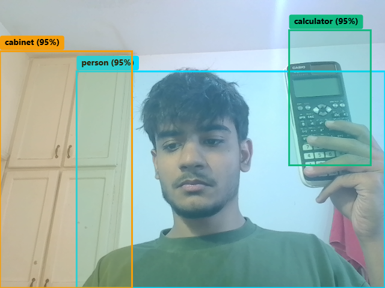

# VisionGround

A real-time object detection web app that runs entirely on CPU — no GPU, no cloud inference.

<!-- Replace this with your actual screenshot path -->


## What it does

- Detects objects from a live webcam feed in the browser
- Runs a 3-stage pipeline to handle small, occluded, and hand-held objects that YOLO misses on its own
- Uses CLIP to recognize objects YOLO was never trained on (like calculators and spray bottles)
- Runs comfortably on a laptop CPU

## The 3-stage pipeline
Webcam frame
│
▼
┌────────────────────────────────────┐
│ STAGE 1 — Spotter │
│ YOLO11n at 640×640 │
│ Finds persons, hands, big objects │
└────────────────┬───────────────────┘
│
▼
┌────────────────────────────────────┐
│ STAGE 2 — Zoomer │
│ MediaPipe HandLandmarker finds │
│ hands → crop that region → 2× │
│ upscale → re-run YOLO on the crop │
│ Catches small / held objects │
└────────────────┬───────────────────┘
│
▼
┌────────────────────────────────────┐
│ STAGE 3 — Namer │
│ CLIP matches each crop against │
│ ~30 text prompts ("calculator", │
│ "spray bottle", "coffee mug", …) │
│ Re-labels when confident │
└────────────────────────────────────┘

## Why 3 models instead of 1

YOLO alone only knows 80 COCO classes. "Calculator" isn't one of them — YOLO calls a calculator a "TV remote". And anything held in your hand is small and occluded, so YOLO can't see it at all.

The fix isn't a bigger model. It's chaining three cheap ones, each doing one job:

| Stage | Model | Job | Cost |
|-------|-------|-----|------|
| 1 | YOLO11n | Find anything obvious | ~40 ms |
| 2 | MediaPipe + YOLO on crop | Recover hand-held / small objects | ~15 ms |
| 3 | CLIP | Give correct names | ~3 ms (cached) |

Total: **~60 ms per frame on CPU**, with an open vocabulary.

## Bugs I found and fixed

Not a tutorial project — this is what actually broke along the way:

1. **MediaPipe's legacy `solutions` API was removed.** My import was wrapped in a `try/except` that only printed a warning, so the entire hand-detection stage was silently dead. Fixed by porting to the current Tasks API (`HandLandmarker`).

2. **CLIP labeled a person as a "deodorant bottle".** A black hoodie with a silver zipper looks like a spray nozzle to CLIP. Fixed by never letting CLIP override trusted classes (`person`, `hand`).

3. **The tracker threw away cached labels.** It matched by label *and* position, so when YOLO flipped "cell phone" ↔ "remote" on the same object between frames, a new track was created and CLIP re-ran every frame. Fixed by matching on position only.

4. **`from google import genai` was a top-level import.** A missing install would crash the whole server for the sake of one diagnostics route. Fixed with a lazy import.

5. **Thread-tuning environment variables were set after importing PyTorch.** PyTorch reads them at import time, so the tuning was silently ignored. Fixed by moving them above the imports.

6. **`CONF_BY_CLASS` had a dead `"hand": 0.35` entry.** YOLO11n's COCO classes don't include "hand" — that line never fired.

**The lesson:** in a multi-model pipeline, bugs live in the glue between the models, not inside them.

## Stack

- **Frontend:** React 19, Vite, TypeScript, Tailwind CSS v4
- **Backend:** FastAPI + Uvicorn (Python)
- **Detection:** Ultralytics YOLO11n
- **Hand tracking:** MediaPipe HandLandmarker (Tasks API)
- **Open-vocabulary labeling:** OpenAI CLIP (ViT-B/32)
- **Error diagnostics:** Google Gemini 2.5 Flash (only fires on crashes, not per frame)

## How to run

```bash
# 1. Install Python dependencies
pip install -r requirements.txt

# 2. Start the backend
python local_vision_server.py
# → runs on http://localhost:8000

# 3. In a separate terminal, install frontend deps and start the dev server
npm install
npm run dev
# → runs on http://localhost:3000
What's next
WebSocket transport instead of HTTP POST (lower latency)

OpenVINO INT8 export for 2–4× CPU speedup

YOLO-World for open-vocabulary detection (replaces the hand-curated CLIP list)

Client-side frame downscaling to reduce upload size

A latency/FPS HUD in the UI